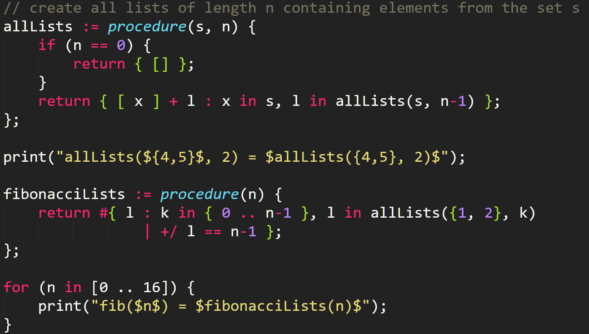

# The SetlX-Helper for Sublime Text 3
*"Wait, why should I use this?"* Good question! Lets ask the official [SetlX-Tutorial](http://randoom.org/?id=setlXdoc)as I recall it:

> 2. Programming [with the] SetlX[-Helper] is the only way to guarantee redemption from the eternal hell fire that awaits those [...] programming in SetlX.
> 3. Programming in SetlX [will then be] fun!

I'm fairly sure you are convinced now ;)

## Installing It
#### Sublime Text 3 / 2
1. [Download](https://www.sublimetext.com/3) and install Sublime Text 3
2. Install Package Control in Sublime Text as described [here](https://packagecontrol.io/installation) and restart Sublime Text
3. Open the Command Palette (by pressing <kbd>Ctrl</kbd>/<kbd>Super</kbd>+<kbd>Shift</kbd>+<kbd>P</kbd>), select `Package Control: Install Package`, wait for the list to load and select `SetlX Helper` from the list
4. After the installation is done (the progress is shown in the lower left corner) you are all set. Just open a SetlX-program file and enjoy the new help!

## Using the Features
#### Syntax Definitions
Just type code ;)

*Keep in mind: The colors don't come from the Helper-Plugin. You can choose them as you like by selecting a Color Scheme you like from the* Preferences *Menu of Sublime Text.*

#### Quickly Open the [Quickreference](https://github.com/LucaVazz/SetlXQuickreference/blob/master/SetlX-Quickreference.pdf)
Open the Command Palette (see above) and select `SetlX Helper: Open the SetlX-Quickreference`.
A new browser-window will open to display the Quickreference.

#### Type Coomon Structures Faster With Snippets
To insert a snippet, just enter its keyword (which is its name, if not noted otherwise below) and press <kbd>Enter</kbd> to insert it. You can then jump through the placeholder by pressing <kbd>Tab</kbd> (and insert a "real" tab by pressing <kbd>Shift</kbd>+<kbd>Tab</kbd>).

**Available snippets:** defenition of a `set` / `list` / `closure` / `procedure` / `cached procedure`, `if`-/`else if`-/`else`- / `match` - / `swtich` - statements, `for` - / `while` - loops, try-catch - (keyword: `catch`) / `trace` - blocks, `case` - / `default` - statements.

## Features to Come Soon / ToDo
| Version |                      Feature                      |                                                                             optional Description                                                                             |
|---------|---------------------------------------------------|------------------------------------------------------------------------------------------------------------------------------------------------------------------------------|
| 0.4.0   | build-system + error-parsing                      | start your program right from within Sublime Text, see the successful output and get the parsed errors directly pinned to the troubled position in your program              |
| 0.5.0   | real-time basic mistake warning                   | marks common (dumb) mistakes (like forgetting a semicolon/a closing bracket, using commas in a vector-definition, etc.) with a warning in real-time in your file as you type |

*Feel free to suggest additional features by using GitHub-Issues.*

### A Note on the Choosen License
This project is licensed under the terms of the *GNU General Public License v3.0*. For further information, please look [here](http://choosealicense.com/licenses/gpl-3.0/) or [here(DE)](http://www.gnu.org/licenses/gpl-3.0.de.html).