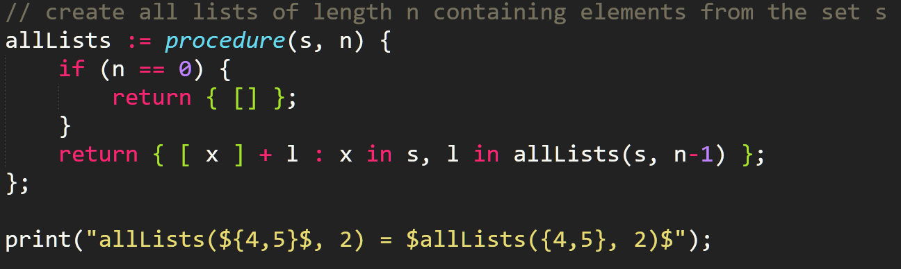

# The SetlX-Helper for Sublime Text 3
*"Wait, why should I use this?"* Good question! Lets ask the official [SetlX-Tutorial](http://randoom.org/?id=setlXdoc)as I recall it:

> 2. Programming [with the] SetlX[-Helper] is the only way to guarantee redemption from the eternal hell fire that awaits those [...] programming in SetlX.
> 3. Programming in SetlX [will then be] fun!

I'm fairly sure you are convinced now ;)

Additionally, this extension is available for SublimeText 2/3 (see [here](https://packagecontrol.io/packages/SetlX%20Helper)) and VisualStudio Code (see [here](https://marketplace.visualstudio.com/items?itemName=LucaVazz.setlx)).

**Current Version**: v1.2.0, compatible with SetlX v2.5.0

## Installing The Extension
#### Sublime Text 3 / 2   
1. Install PackageControl in Sublime Text as described [here](https://packagecontrol.io/installation) and restart Sublime Text
2. Open the Command Palette (by pressing <kbd>Ctrl</kbd>/<kbd>Super</kbd>+<kbd>Shift</kbd>+<kbd>P</kbd>), select `Package Control: Install Package`, wait for the list to load and select `SetlX Helper` from the list (by typing in `setlx` and pressing <kbd>Enter</kbd>)
3. After the installation is done (the progress is shown in the lower left corner) you are all set. Just open a SetlX-program file and enjoy the new help!
4. ***optional:*** *I recommend using the* Monokai Extended *Color Scheme (available via PackageControl) for a nice and colorful syntax-highlighting.*

#### VisualStudio Code   
1. Open the Command Palette (by pressing <kbd>Ctrl</kbd>+<kbd>P</kbd>), type in `ext install setlx` and press <kbd>Enter</kbd>
2. After the installation is done, restart VS Code when the prompt asking you to do it appears. Then you are all set. Just open a SetlX-program file and enjoy the new help!
3. ***optional:*** *I recommend using the* Monokai *Color Theme for a nice and colorful syntax-highlighting.*

## Using the Features
*The icons in brackets indicate for which editor the feature is implemented.*

#### Syntax Highligting   ( )

Just type code ;)

*Keep in mind:* The colors don't come from the Helper-Plugin. You can choose them as you like by selecting a Theme which suits you: 
*  : *Preferences* ➜ *Color Scxheme*
*  : *File* ➜ *Settings* ➜ *Color Theme*

#### Type Common Structures Faster With Snippets   ( )

To insert a snippet, just enter its keyword (which is its name, if not noted otherwise below) and press <kbd>Enter</kbd> to insert it. You can then jump through the placeholders by pressing <kbd>Tab</kbd> ( : and insert a "real" tab by pressing <kbd>Shift</kbd>+<kbd>Tab</kbd>).

*Available snippets:* 
+ `set` - / `list` - / `closure` - / `procedure` - / `cached procedure` - definition
+ `if` - / `else if` - / `else`- / `match` - / `swtich`- / `case` - / `default` - statements
+ `for` - / `while` - loops
+ try-catch - (keyword: `catch`) / `trace` - blocks

#### Build System   ()
You need to install SetlX *completely* as described in its [manual](http://randoom.org/Software/SetlX). This means that you should be able to type `setlx` into a console-window and get the live interpreter fired up.

After that, you can just press <kbd>Ctrl</kbd>/<kbd>Cmd</kbd>+<kbd>B</kbd> to start your SetlX-program and view its results inside Sublime Text's own console (at the bottom of your window).

You can switch between running your program inside Sublime Text's own Build-Console (at the bottom of the window) (which doesn't support input) or in an external Command-Line - window by pressing <kbd>Ctrl</kbd>/<kbd>Cmd</kbd>+<kbd>Shift</kbd>+<kbd>B</kbd> and selecting either `SetlX - in internal Build-Console` or `SetlX - in external Command-Line`.

If you just press <kbd>Ctrl</kbd>/<kbd>Cmd</kbd>+<kbd>B</kbd> or just select `SetlX` in the selection-menu mentioned above, the previously selected option will be used.

## Contributing
Feel free to suggest *additional features* or to *report bugs* by using the [GitHub-Issues](https://github.com/LucaVazz/SetlXHelper/issues).

I'm also always pleased to see *pull-request*, for example if you have ported the extension to other editors or added a cool new functionality.

If you see an issue in the backlog which isn't assigned to anyone yet, it's is up for grabs for ***you***! Just drop a comment and start working on it.

## A Note on the Chosen License
This project is licensed under the terms of the *GNU General Public License v3.0*. For further information, please look [here](http://choosealicense.com/licenses/gpl-3.0/) or [here(DE)](http://www.gnu.org/licenses/gpl-3.0.de.html).

## A Note on Used Material
* The syntax highlighting is (obviously) based on the [SetlX Grammar](https://github.com/herrmanntom/setlX/blob/master/interpreter/core/src/main/antlr/SetlXgrammar.g).
* The icons in this readme are taken from the [TypeScript Homepage](https://www.typescriptlang.org/index.html#download-links).
